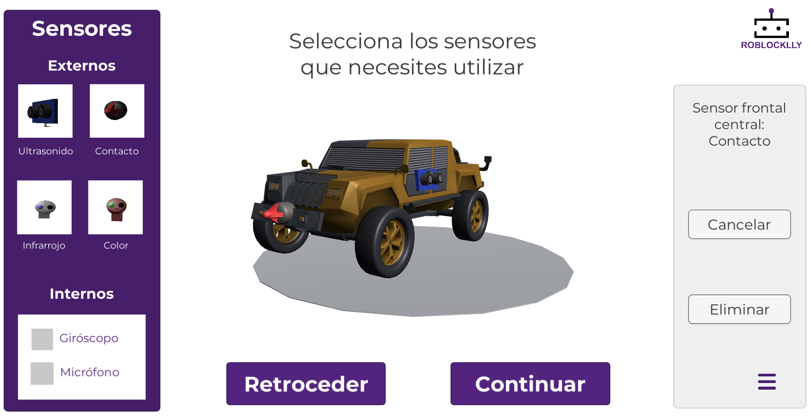

# RoblockLLy
Source code of RoblockLLy, an educational robotics simulator based on Unity and UBlockly. This version of the simulator can be accessed through the following [link](https://computational-thinking.github.io/RoblockLLy/).

